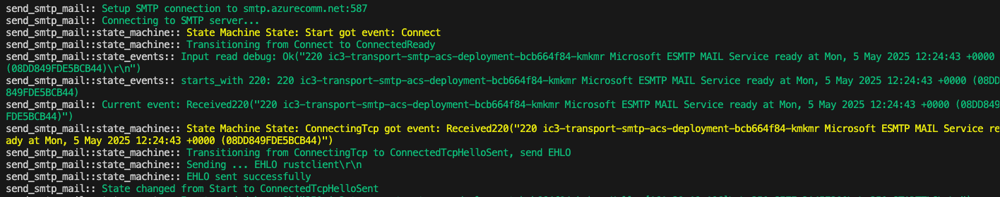

# rust-smtp-email-openssl
Send an email through a smtp server.
Client does tcp connection and send the SMTP commands one by one, after STARTTLS it upgrades the tcp session to TLS encrypted and authenticates and then sends mail and base64 encoded attachement.

Very basic and crude for basic SMTP debugging

With .env file can set smtp_ server and user settings, add attachement with smtp_attachment_path
see example .env-example

## Usage

1. create .env or set environment variables using export
   - smtp_username=
   - smtp_password=
   - smtp_server=<dns.name>:<port>
   - smtp_from=
   - smtp_to=
   - smtp_attachment_path=<temp_20MB_file.zip>

2. run ```cargo run```

## Generate random file to test attachement

 - e.g. Create 7MB file
   
       random_file_size_MB=7
       dd if=/dev/urandom of=temp_${random_file_size_MB}MB_file.txt bs=1M count=${random_file_size_MB}
       gzip temp_${random_file_size_MB}MB_file.txt
       ls -lh temp_${random_file_size_MB}MB_file.txt.gz 

## History

- 2025-05 Remove dependancy on openssl replaced with Rust TLS, now client is all rust, about 4.4MB compiled.

## Screen shot

- Step by step output of state machine and events

  